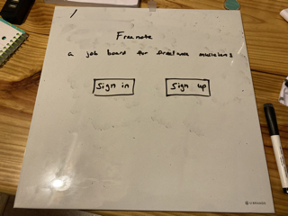
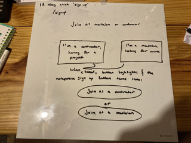
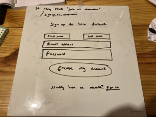
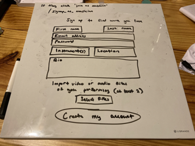
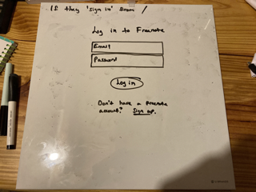

Job board for freelance musicians
Upwork inspired

App walkthrough/routes:
Landing page (/)

Sign up (/signup)

If they click 'join as contractor'

If they click 'join as musician'

If they 'sign in' from /

Relationships:

Musician will have many jobs
Musician will have many contractors through jobs

Jobs belong to Musician
Jobs belong to Contractor

Contractor will have many Jobs
Contractor will have many Musicians through Jobs

Models/attributes: 
Musician: name, password_digest, id, email, media, image_url, bio, instrument
Contractor: name, password_digest, id, email, image_url, bio
Job: musician_id, contractor_id, name, location, description, date

