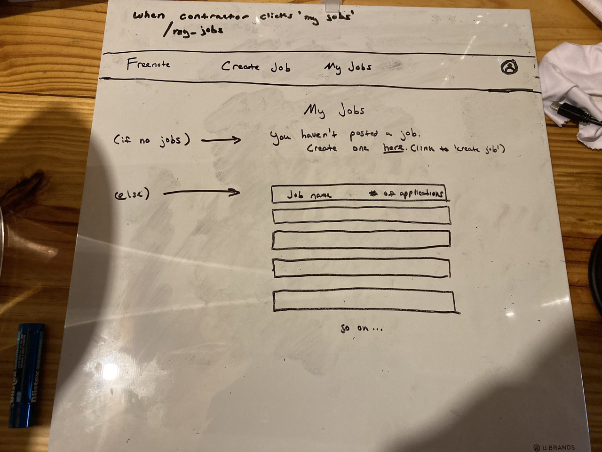

Job board for freelance musicians
Upwork inspired

App walkthrough/routes:  

Account create/sign in  

- Landing page (/)  

- Sign up (/signup)   

- If they click 'join as contractor' (/signup_as_contractor)  

- If they click 'join as musician' (/signup_as_musician)  
 
- If they 'sign in' from / (/signin)  
  

Contractor experience:  

- When contractor signs in or up. And, when they click 'create job' in nav later. (/create_job) 

- When contractor clicks 'my jobs' (/my_jobs)  

- When contractor clicks on a job in 'my jobs' (/my_jobs/job/:id)  

- When contractor clicks on profile icon (/:contractor_first_and_last_name/profile)  

Musician experience:  

- When musician signs in or up, and when they click 'find work' (/find_work) 

- When musician clicks 'apply' on a job posting (/find_work/job/:id)  

- When musician clicks on 'my applications (or my jobs)' (/my_applications)  
  
Include all job info in those boxes.  
- When musician clicks on profile icon (/:musician_first_and_last_name/profile)  

Models:  
- Musician has many Contractors through Jobs
- Musician has many Jobs
- Musician has many Applications
- Musician has many Jobs through Applications  

- Jobs belongs to Musician
- Jobs belongs to Contractor
- Job has many Applications
- Job has many Musicians through Applications  

- Application belongs to Musician
- Application belongs to Job  

- Contractor has many Musicians through Jobs
- Contractor has many Jobs

Attributes:

Musician:  
- first_name
- last_name
- email
- password
- instrument
- location
- bio
- media  

Contractor:  
- first_name
- last_name
- email
- password  

Job:  
- headline
- description
- date
- location
- budget :integer
- applications_from_musicians :integer
- musician_id
- contractor_id

Application:  
- resume
- cover_letter
- accepted :boolean
- musician_id
- job_id

